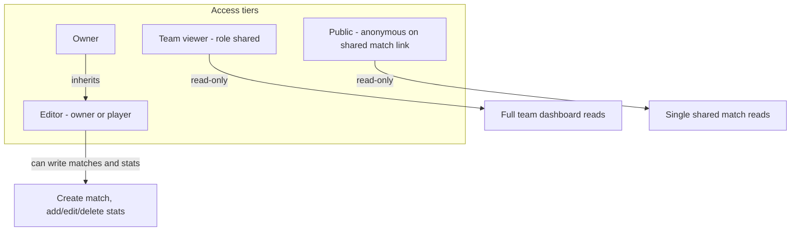
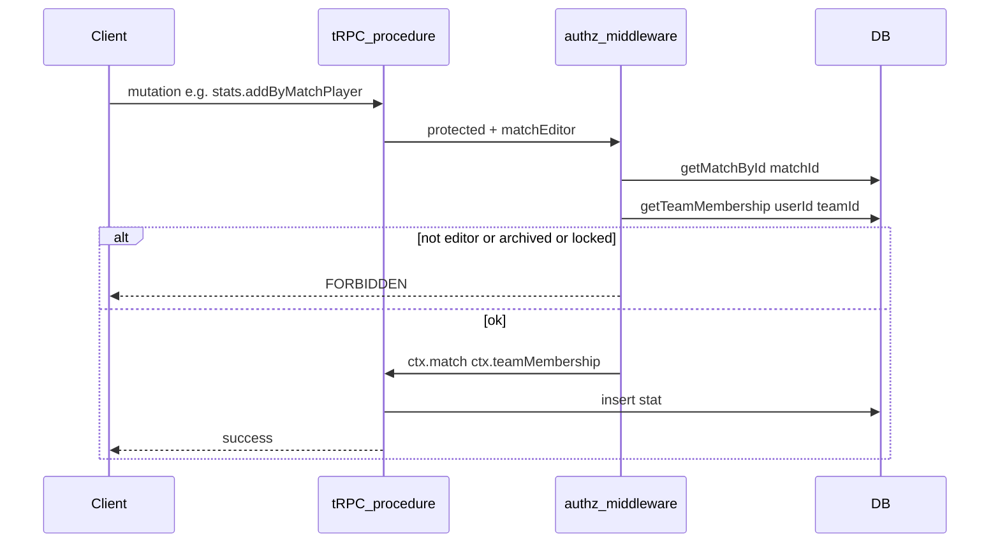
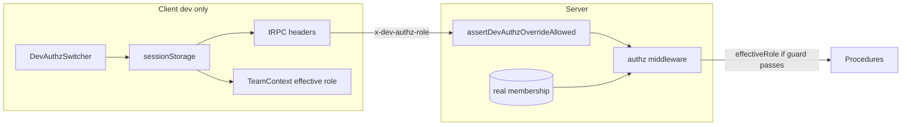

# API Authorization Plan

## Confirmed permission model

Based on your answers, the app has **four access tiers** (not just three roles):



| Capability                                                     | Owner | Player | Shared viewer | Public (shared link)    |
| -------------------------------------------------------------- | ----- | ------ | ------------- | ----------------------- |
| View team dashboard (matches, members, season stats)           | yes   | yes    | yes           | no                      |
| View match analysis                                            | yes   | yes    | yes           | yes (if `match.shared`) |
| Create matches                                                 | yes   | yes    | no            | no                      |
| Add / undo / reset stats                                       | yes   | yes    | no            | no                      |
| Match settings (share link, lock, reset sets)                  | yes   | no     | no            | no                      |
| Roster management (add player, activate, transfer ownership)   | yes   | no     | no            | no                      |
| Team settings (viewer access, match settings, archive, delete) | yes   | no     | no            | no                      |

**Cross-cutting write guards** (apply on top of editor/owner checks):

- `team.archived === true` blocks all writes for owner and player
- `match.lockedAnalysis === true` blocks stat add/delete for that match

**Important UI gap today:** the API will grant players write access, but the UI still gates writes with `isOwner` in [`NewMatchForm.tsx`](src/components/NewMatchForm.tsx) and [`MatchAnalysis.tsx`](src/components/MatchAnalysis.tsx). Both must be updated to match.

---

## Architecture

### 1. New authz module

Create [`src/server/authz/`](src/server/authz/) with three files:

**[`queries.ts`](src/server/authz/queries.ts)** — single source of DB lookups:

- `getTeamMembership(db, userId, teamId)` → `{ role, teamArchived } | null`
- `getMatchById(db, matchId)` → match row or null
- `assertMatchBelongsToTeam(match, teamId)` — fixes existing bug where `stats.byMatch` accepts mismatched `teamId`/`matchId`

**[`permissions.ts`](src/server/authz/permissions.ts)** — pure role helpers (easy to unit-test):

- `canReadTeam(role)` → owner | player | shared
- `canEditTeam(role)` → owner | player
- `canManageTeam(role)` → owner only
- `canReadMatch({ membership, matchShared, hasSession })` → member OR shared match
- `canEditMatch({ membership, teamArchived, matchLocked })` → editor AND not archived AND not locked

**[`middleware.ts`](src/server/authz/middleware.ts)** — tRPC middleware factories that attach context:

```typescript
// Context extensions (added to ctx after middleware runs)
type AuthzContext = {
  teamMembership?: { teamId: number; role: Role; teamArchived: boolean };
  match?: typeof matches.$inferSelect;
};
```

### 2. Procedure tiers in [`trpc.ts`](src/server/api/trpc.ts)

Keep existing `publicProcedure` and `protectedProcedure`. Add four composable tiers:

| Procedure              | Auth      | Input shape                            | Behavior                                               |
| ---------------------- | --------- | -------------------------------------- | ------------------------------------------------------ |
| `teamMemberProcedure`  | logged in | `{ teamId: number }` + rest            | membership required; any role                          |
| `teamEditorProcedure`  | logged in | `{ teamId: number }` + rest            | owner or player; rejects if archived                   |
| `teamOwnerProcedure`   | logged in | `{ teamId: number }` + rest            | owner only                                             |
| `matchReaderProcedure` | optional  | `{ matchId: number; teamId?: number }` | member OR `match.shared`; validates teamId if provided |
| `matchEditorProcedure` | logged in | `{ matchId: number }` + rest           | resolves match → team; editor + not archived           |

For stat mutations specifically, add a small inline check (or `matchStatEditorProcedure`) that also rejects when `match.lockedAnalysis === true`.

Use `TRPCError` with `FORBIDDEN` / `NOT_FOUND` and existing Polish messages where applicable.

### 3. Auth flow diagram



---

## Procedure migration map

### [`user.ts`](src/server/api/routers/user.ts)

| Procedure                          | Current               | Target                                                                                                                                                                                                                                                                                                       |
| ---------------------------------- | --------------------- | ------------------------------------------------------------------------------------------------------------------------------------------------------------------------------------------------------------------------------------------------------------------------------------------------------------ |
| `isInTeam`, `isOwnerOfTeam`        | protected, self-check | keep as-is (used by layout)                                                                                                                                                                                                                                                                                  |
| `updateFullName`                   | protected             | keep; already scoped to `ctx.session.user.id`                                                                                                                                                                                                                                                                |
| `byQueryNotInTeam`                 | protected             | **teamOwnerProcedure**                                                                                                                                                                                                                                                                                       |
| `byQueryNotViewerOfTeam`           | protected             | **teamOwnerProcedure**                                                                                                                                                                                                                                                                                       |
| `byTeamPlayers`                    | public                | **matchReaderProcedure** OR **teamMemberProcedure** — used on shared match page with `teamId`; use `matchReaderProcedure` when `matchId` is available, otherwise `teamMemberProcedure` for dashboard. Simplest fix: split into two call sites or add optional `matchId` to input for public path enforcement |
| `byTeamViewers`                    | protected             | **teamOwnerProcedure**                                                                                                                                                                                                                                                                                       |
| `updateIsActive`, `updateTeamRole` | protected             | **teamOwnerProcedure**                                                                                                                                                                                                                                                                                       |

**`byTeamPlayers` decision:** add optional `matchId` to input. When called from [`/shared/[matchId]`](src/app/shared/[matchId]/page.tsx), pass `matchId` so the middleware can verify `match.shared`. When called from dashboard, `teamMemberProcedure` is sufficient.

### [`team.ts`](src/server/api/routers/team.ts)

| Procedure                                                                                                     | Target                                                                           |
| ------------------------------------------------------------------------------------------------------------- | -------------------------------------------------------------------------------- |
| `create`                                                                                                      | keep `protectedProcedure` (creates new team, no existing teamId)                 |
| `addPlayer`, `shareViewerAccess`, `revokeViewerAccess`, `saveMatchSettings`, `archive`, `unarchive`, `delete` | **teamOwnerProcedure**                                                           |
| `byId`, `seasons`                                                                                             | **teamMemberProcedure**                                                          |
| `matchSettings`                                                                                               | **teamEditorProcedure** (players need this for score validation in NewMatchForm) |
| `ofUser`                                                                                                      | keep `protectedProcedure` (scoped to session user)                               |
| `ofViewer`                                                                                                    | unused in frontend — remove or leave; low priority                               |

**Fix `archive` / `unarchive`:** drop client-supplied `userId` from input; always use `ctx.session.user.id` (same pattern as [`delete`](src/server/api/routers/team.ts) already uses). Update [`ArchiveTeamDialog.tsx`](src/components/ArchiveTeamDialog.tsx) accordingly.

### [`match.ts`](src/server/api/routers/match.ts)

| Procedure                                                                       | Target                                                                       |
| ------------------------------------------------------------------------------- | ---------------------------------------------------------------------------- |
| `create`                                                                        | **teamEditorProcedure**                                                      |
| `byId`                                                                          | **matchReaderProcedure**                                                     |
| `byTeamRecent`, `byTeamWithStats`                                               | **teamMemberProcedure**                                                      |
| `toggleShare`, `toggleAnalysisLock`, `deleteByMatchIdAndSet` (via stats router) | **teamOwnerProcedure** via match → team resolution, OR add `teamId` to input |

For owner-only match mutations that only receive `matchId`, middleware resolves `match.teamId` then runs owner check.

### [`stats.ts`](src/server/api/routers/stats.ts)

| Procedure                         | Target                                                        |
| --------------------------------- | ------------------------------------------------------------- |
| `addByMatchPlayer`, `delete`      | **matchEditorProcedure** + `!lockedAnalysis`                  |
| `deleteByMatchIdAndSet`           | **teamOwnerProcedure** (via match resolve)                    |
| `byMatch`, `byMatchPlayer`        | **matchReaderProcedure** + validate `teamId === match.teamId` |
| `byTeamAndSeason`, `byTeamPlayer` | **teamMemberProcedure**                                       |

---

## Frontend alignment

### Extend [`TeamContext.tsx`](src/components/TeamContext.tsx)

Replace boolean-only `isOwner` with:

```typescript
role: Role | null; // null on anonymous shared-match pages
canEdit: boolean; // owner || player
isOwner: boolean; // keep for owner-only UI
```

Fetch role in [`dashboard/[teamId]/layout.tsx`](src/app/dashboard/[teamId]/layout.tsx) via a new lightweight query (e.g. extend `isInTeam` to return `{ isInTeam, role }` instead of adding a third layout call).

### Update UI gates

| Component                                                       | Change                                                                                         |
| --------------------------------------------------------------- | ---------------------------------------------------------------------------------------------- |
| [`NewMatchForm.tsx`](src/components/NewMatchForm.tsx)           | `disabled={!canEdit \|\| isArchived}`                                                          |
| [`MatchAnalysis.tsx`](src/components/MatchAnalysis.tsx)         | `canAddStatistic` uses `canEdit` instead of `isOwner`; match settings dropdown stays `isOwner` |
| [`AddPlayerForm.tsx`](src/components/AddPlayerForm.tsx)         | stays `isOwner`                                                                                |
| [`PlayerStatsDialog.tsx`](src/components/PlayerStatsDialog.tsx) | stays `isOwner` for roster settings                                                            |
| [`TeamPageNavbar.tsx`](src/components/TeamPageNavbar.tsx)       | settings tab stays `isOwner`                                                                   |

Shared team viewers (`role === "shared"`) already cannot see the settings tab; no change needed there.

---

## Dev-only permission switcher (eye-testing)

A floating **DevAuthzSwitcher** lets developers preview the app as **owner**, **player**, **shared viewer**, or **public reader**, plus optional **archived team** / **locked match** flags — without juggling multiple accounts.

### Goals

- Switch effective permission tier in seconds while developing
- Apply to **both UI gates and API authorization** so buttons and mutations behave like production
- **Never ship** to production builds; **not callable** outside local dev even if someone crafts headers

### Security model (defense in depth)

Use multiple independent gates so a single mistake cannot expose bypass in production:

| Layer                  | Guard                                                                                                                                      | Purpose                                                                   |
| ---------------------- | ------------------------------------------------------------------------------------------------------------------------------------------ | ------------------------------------------------------------------------- |
| 1. Build               | `process.env.NODE_ENV === "development"` in [`layout.tsx`](src/app/layout.tsx) before importing/rendering switcher                         | Dead-code elimination strips component from `next build` output           |
| 2. Server env          | `DEV_AUTHZ_OVERRIDE=true` in `.env.local` only (add to [`env.js`](src/env.js) **server** schema, **not** `NEXT_PUBLIC_*`)                  | Production deploys omit var → server ignores override even if header sent |
| 3. Server runtime      | `assertDevAuthzOverrideAllowed()` at top of override path: `NODE_ENV === "development"` **and** `env.DEV_AUTHZ_OVERRIDE === true`          | Blocks preview/staging unless explicitly opted in                         |
| 4. No prod routes      | No tRPC procedure to “set role”; override is **header-only**, parsed inside existing authz middleware                                      | No discoverable API surface                                               |
| 5. Header whitelist    | Accept only `x-dev-authz-role: owner \| player \| shared \| public` (reject unknown values)                                                | Prevents arbitrary privilege strings                                      |
| 6. Still authenticated | Override changes **effective role**, not identity — `protectedProcedure` still requires a real session (except `public` preset, see below) | Cannot impersonate another user’s `userId`                                |

**Do not** add `NEXT_PUBLIC_DEV_*` flags — they embed into client bundles and are easier to misuse.



### Files to add

| File                                                                                 | Responsibility                                                                                 |
| ------------------------------------------------------------------------------------ | ---------------------------------------------------------------------------------------------- |
| [`src/dev/authz-override.ts`](src/dev/authz-override.ts)                             | Shared types, `DEV_AUTHZ_HEADER`, role enum, `parseDevAuthzRole()`                             |
| [`src/dev/assert-dev-authz-override.ts`](src/dev/assert-dev-authz-override.ts)       | Server-only `assertDevAuthzOverrideAllowed()` + `getDevEffectiveRole(headers)`                 |
| [`src/components/dev/DevAuthzSwitcher.tsx`](src/components/dev/DevAuthzSwitcher.tsx) | Collapsible floating UI (`"use client"`)                                                       |
| [`src/components/dev/DevAuthzProvider.tsx`](src/components/dev/DevAuthzProvider.tsx) | React context: `overrideRole`, `simulateArchived`, `simulateLocked`, setters, `isActive` badge |

### UI behavior

- **Placement**: fixed `bottom-4 left-4`, `z-[9999]` — away from typical bottom-right IDE/AI chrome
- **Collapsed**: single small icon button (~40px), `opacity-50`, semi-transparent; `aria-label="Dev authz"`; does not cover main content
- **Expanded**: compact card (~240px) with:
  - Role preset: Owner | Player | Shared | Public | **Off** (use real DB role)
  - Toggles: “Archived team”, “Locked match” (override cross-cutting guards for eye-testing)
  - Small “DEV” badge when override active
- **Interaction**: `pointer-events-auto` only on the control; no full-screen overlay; panel collapses on outside click optional
- **Persistence**: `sessionStorage` key e.g. `hladstat:dev-authz` so refresh keeps selection during a dev session

Mount in [`src/app/layout.tsx`](src/app/layout.tsx) **only** when:

```tsx
{
  process.env.NODE_ENV === "development" ? (
    <DevAuthzProvider>
      {children}
      <DevAuthzSwitcher />
    </DevAuthzProvider>
  ) : (
    children
  );
}
```

Use a **direct static import** guarded by the condition above (not `next/dynamic` without the guard) so Next can tree-shake the dev chunk in production builds.

### Integration with authz + TeamContext

1. **TeamContext** ([`TeamContext.tsx`](src/components/TeamContext.tsx)): after resolving real `role` from server/layout, if `DevAuthzProvider` has an active override, compute:
   - `effectiveRole` from override (or real role when Off)
   - `canEdit` / `isOwner` from `permissions.ts` using **effective** role + dev toggles (`simulateArchived` forces read-only for editors)
2. **tRPC client** ([`src/trpc/react.tsx`](src/trpc/react.tsx)): in `httpBatchLink` `headers()`, when dev override active, set `x-dev-authz-role` (and optional `x-dev-authz-archived`, `x-dev-authz-locked` as `"1"`/`"0"`)
3. **Authz middleware** ([`src/server/authz/middleware.ts`](src/server/authz/middleware.ts)): after loading real `teamMembership` from DB, call `getDevEffectiveRole(ctx.headers)`; if non-null and guard passes, replace `ctx.teamMembership.role` (and archived/locked flags) for permission checks only — **do not** change `ctx.session.user.id`

**`public` preset**: effective role treats caller as non-member for team routes; match reads allowed only when `match.shared` (same as real public). UI on dashboard may still show layout if user is logged in — document that “Public” is for testing **authorization behavior**, not a full logout simulation; optional follow-up: add “hide write UI as if logged out” without signing out.

### What this does _not_ do

- No bypass in `next build` / `next start` production mode
- No override on Uploadthing or NextAuth — only app authz layer
- No changing another user’s data identity — only permission tier for **your** session

### Verification checklist

- `bun run build` → search `.next` output: no `DevAuthzSwitcher` string / no dev header references in server chunks
- Production `NODE_ENV` + missing `DEV_AUTHZ_OVERRIDE` → forged `x-dev-authz-role` returns real DB permissions
- Dev with override off → identical behavior to today

---

## Public shared-match enforcement

Today, [`shared/[matchId]/layout.tsx`](src/app/shared/[matchId]/layout.tsx) blocks the page when `!match.shared`, but the underlying procedures (`match.byId`, `stats.byMatch`, `user.byTeamPlayers`) are public with no check — callable directly via tRPC.

After migration:

- `matchReaderProcedure` returns `FORBIDDEN` unless `match.shared === true` OR caller is a team member
- `stats.byMatch` / `stats.byMatchPlayer` validate `input.teamId === match.teamId`
- `user.byTeamPlayers` requires either team membership or a shared `matchId` in input

Anonymous users on `/shared/{matchId}` continue to work; logged-in team members hitting a shared link still redirect to dashboard (existing behavior in layout).

---

## Implementation order

Recommended sequence to keep the app working throughout:

1. **Authz foundation** — `queries.ts`, `permissions.ts`, middleware, procedure tiers in `trpc.ts`
2. **Reads first** — migrate `byId`, `byMatch`, `byTeamPlayers`, `byTeamAndSeason`, etc. (tightens security without breaking writes)
3. **Writes** — migrate mutations; fix archive `userId` bug
4. **Frontend** — TeamContext role/canEdit, player write buttons, archive dialog input cleanup
5. **Dev switcher** — `DevAuthzProvider` + floating `DevAuthzSwitcher`; wire tRPC headers + authz middleware override; add `DEV_AUTHZ_OVERRIDE` to server env schema and `.env.example` (document local-only)
6. **Cleanup** — remove redundant per-handler owner checks in routers (middleware replaces them); consider removing unused `team.ofViewer`

---

## Testing strategy (recommended)

Add unit tests for [`permissions.ts`](src/server/authz/permissions.ts) covering:

- each role × each capability
- archived team blocks editor writes
- locked match blocks stat writes
- public reader allowed only when `match.shared`

Optional integration smoke tests for 2–3 critical paths (shared match read anonymous, player stat add, shared viewer mutation rejected).

---

## Out of scope (unless you want them included)

- Uploadthing ([`uploadthing.ts`](src/server/uploadthing.ts)) — auth-only today, no team scoping; fine for profile pictures
- Rate limiting on public match endpoints
- Audit logging for authorization failures
- Full logout simulation for “public” preset (session remains; only effective permissions change)
